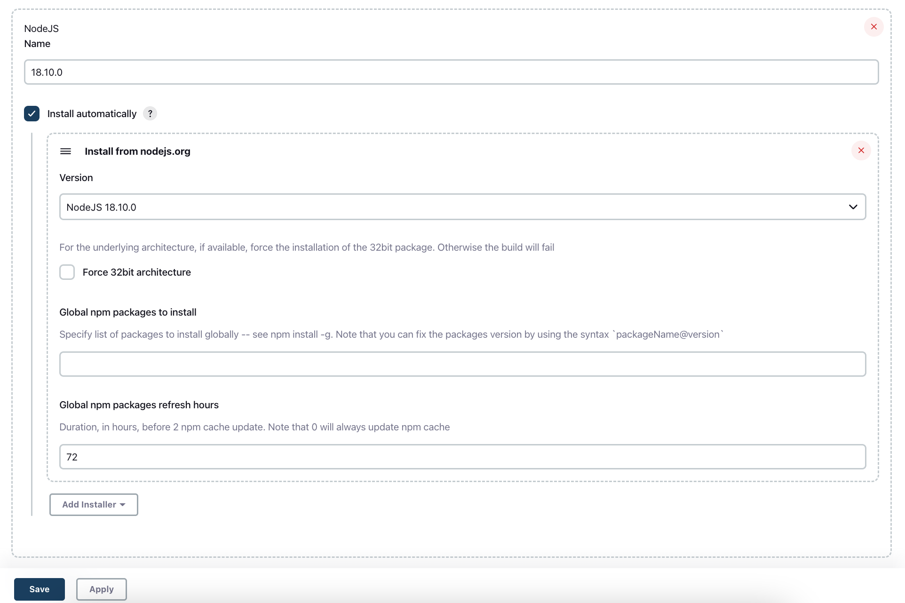

## Jenkins Setup

- Launch your Jenkins server
- Navigate to Manage Jenkins > Manage Plugins 
- Install `NodeJS Plugin`
- Make sure that you have Pipeline and Pipeline: GitHub Groovy Libraries plugins installed 
- Navigate to Manage Jenkins > Global Toll Configurations > NodeJS installations > Add Node JS
- Choose version `NodeJs 18.10.0`
- To the name field add `18.10.0`

[](https://god.gw.postman.com/run-collection/9f5bbfbd3377d01ba6da?action=collection%2Fimport#?env%5BQA%20dropbox%20env%5D=W3sia2V5IjoidXJsIiwidmFsdWUiOiJodHRwczovL2FwaS5kcm9wYm94YXBpLmNvbS8yLyIsImVuYWJsZWQiOnRydWUsInR5cGUiOiJkZWZhdWx0In0seyJrZXkiOiJmaWxlSWQiLCJ2YWx1ZSI6ImlkOmlTQmVrZHdrV3hvQUFBQUFBQUFBTlEiLCJlbmFibGVkIjp0cnVlLCJ0eXBlIjoiYW55In0seyJrZXkiOiJmaWxlUGF0aCIsInZhbHVlIjoiL0hvbWV3b3JrL0ludHJvLnR4dCIsImVuYWJsZWQiOnRydWUsInR5cGUiOiJhbnkifSx7ImtleSI6ImZpbGVOYW1lIiwidmFsdWUiOiJJbnRyby50eHQiLCJlbmFibGVkIjp0cnVlLCJ0eXBlIjoiYW55In0seyJrZXkiOiJ1cGxvYWRVcmwiLCJ2YWx1ZSI6Imh0dHBzOi8vY29udGVudC5kcm9wYm94YXBpLmNvbS8yL2ZpbGVzL3VwbG9hZCIsImVuYWJsZWQiOnRydWUsInR5cGUiOiJkZWZhdWx0In1d)